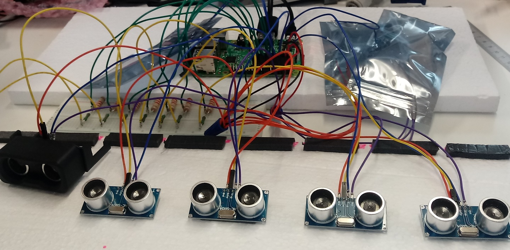

# 8 x Ultrasonic Distance Sensors HC-SR04

In this project, we measure the distance to objects based on the ultrasonic distance sensors HC-SR04. 

A watchdog timeout has been used, to represent the environment and measures objects' distance up to 30 cm. 

The ultrasonic sensors are activated sequentially to avoid interferences.

## Photo of the Setup 

## Code output

#### R&D
Date: 14-10-2020 

Programmer: AK MT

[DRINKOTEC](https://drinkotec.ch/)

